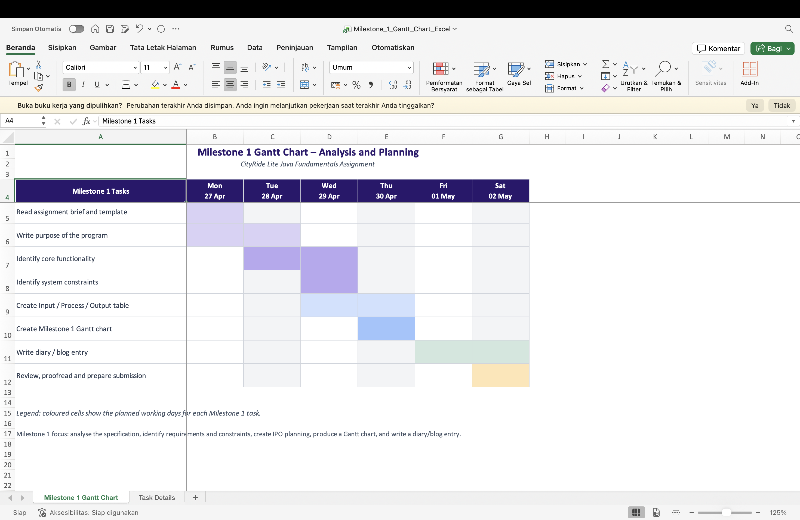

# IY4113 Milestone 1

| Assessment Details | Please Complete All Details |
| ------------------ | --------------------------- |
| Group              |                             |
| Module Title       |                             |
| Assessment Type    |                             |
| Module Tutor Name  |                             |
| Student ID Number  |                             |
| Date of Submission |                             |
| Word Count         |                             |

- [ ] *I confirm that this assignment is my own work. Where I have referred to academic sources, I have provided in-text citations and included the sources in
  the final reference list.*

- [ ] *Where I have used AI, I have cited and referenced appropriately.

------------------------------------------------------------------------------------------------------------------------------

### Purpose of the Program

------------------------------------------------------------------------------------------------------------------------------

The purpose of the program is to create a console-based Java application called **CityRide Lite**. The program is designed to help a user record and monitor public transport journeys for one day. It will allow the user to enter journey information, calculate the correct fare, apply discounts, apply daily fare caps, and review the journeys that have been entered during the current session.

The program will act as a simple daily travel companion. It will not connect to a database or save information permanently. Instead, all journeys will be stored in memory while the program is running. This means that when the program closes, all journey information will be lost. The program must therefore focus on correct input validation, accurate fare calculation, and clear menu-based interaction with the user.

The core functionality of the program will include:

- Displaying a main menu until the user chooses to exit.
- Adding a new journey by asking for the date, time band, start zone, destination zone, and passenger type.
- Validating all user input so that invalid data does not crash the program.
- Calculating zones crossed using the formula `abs(toZone - fromZone) + 1`.
- Looking up the base fare using the supplied CityRide dataset.
- Applying passenger discounts:
  - Adult: 0%
  - Student: 25%
  - Child: 50%
  - Senior Citizen: 30%
- Applying daily caps for each passenger type:
  - Adult: £8.00
  - Student: £6.00
  - Child: £4.00
  - Senior Citizen: £7.00
- Storing all journeys entered during the current session.
- Listing all journeys in the order they were entered.
- Filtering journeys by passenger type, time band, zone, or date.
- Removing a journey by its unique journey ID.
- Resetting the full day after confirmation.
- Displaying a daily summary including total journeys, total cost, average journey cost, and the most expensive journey.
- Displaying totals by passenger type and category counts.

The main system constraints are:

- The application must be console-based only.
- The program must be written in Java.
- Journey data only needs to be stored in memory, so no file or database storage is required.
- Valid zones are limited to zones 1 to 5.
- Valid time bands are Peak and Off-peak.
- Valid passenger types are Adult, Student, Child, and Senior Citizen.
- The supplied CityRide dataset must be used and should not be changed.
- Monetary values should be displayed to two decimal places.
- The program should recover from invalid input by showing a clear error message and asking the user to try again.
- The program should maintain a single active passenger session during one run of the program.

------------------------------------------------------------------------------------------------------------------------------

### Input Process Output Table

------------------------------------------------------------------------------------------------------------------------------

| Main Function | Inputs | Processes | Outputs |
| ------------ | ------ | --------- | ------- |
| Display main menu | User menu choice | Show menu options; read user choice; validate that the choice matches an available option; repeat menu until exit is selected | Selected action is performed or an error message is shown for invalid menu input |
| Add journey | Date, time band, from zone, to zone, passenger type | Validate required fields; check zones are numeric and between 1 and 5; check passenger type and time band are valid; calculate zones crossed; get base fare from dataset; apply discount; apply passenger daily cap; assign unique journey ID; store journey in memory | Confirmation message showing that the journey has been added; journey details including charged fare |
| Calculate zones crossed | From zone, to zone | Apply formula `abs(toZone - fromZone) + 1` | Number of zones crossed |
| Calculate fare | From zone, to zone, time band, passenger type, current passenger total | Look up base fare from dataset; apply correct passenger discount; check daily cap; reduce charged fare if the discounted fare would exceed the cap | Base fare, discount amount, discounted fare, charged fare after cap |
| List all journeys | Menu choice to list journeys | Retrieve stored journeys from memory; sort/display in order entered | Table/list showing ID, date, from zone, to zone, time band, passenger type, zones crossed, base fare, discount, and charged fare |
| Filter journeys | Filter type and filter value, such as passenger type, time band, zone, or date | Validate filter option; search stored journeys for matching records | List of matching journeys or message saying no journeys matched the filter |
| Remove journey | Journey ID and confirmation | Check whether journey ID exists; ask user to confirm; remove journey if confirmed; recalculate totals and caps from remaining journeys | Success message if removed, cancellation message if not confirmed, or error message for invalid ID |
| Reset day | Confirmation input | Ask user to confirm reset; clear all journeys and passenger totals if confirmed | Success message that all journeys have been cleared, or cancellation message |
| Daily summary | Menu choice to view summary | Count total journeys; calculate total charged cost; calculate average cost; find most expensive journey by charged fare | Total journeys, total cost, average cost per journey, most expensive journey ID and fare |
| Totals by passenger type | Menu choice to view totals | Group journeys by passenger type; calculate journey count, pre-discount total, discounted total, charged total, and cap status | Passenger type summary table showing totals and whether cap was reached |
| Category counts | Stored journey data | Count peak and off-peak journeys; count journeys by zone pair or zone involved | Category count results showing journey distribution |
| Exit program | Exit menu choice | Confirm or process exit; stop the menu loop | Closing message and program ends |
------------------------------------------------------------------------------------------------------------------------------

### Gantt Chart

------------------------------------------------------------------------------------------------------------------------------

------------------------------------------------------------------------------------------------------------------------------

### Diary Entries

------------------------------------------------------------------------------------------------------------------------------

**Diary Entry 1: Understanding the assignment brief**  
During the first stage of the project, I read through the assignment brief carefully to understand what the CityRide Lite application needs to do. I identified that the program must be a console-based Java application that records public transport journeys for one day. I also highlighted the main requirements, including adding journeys, listing journeys, filtering journeys, removing journeys, resetting the day, calculating fares, applying discounts, and enforcing daily caps.

I did this because a clear understanding of the requirements is needed before starting the design or coding stages. If the requirements are misunderstood at the start, the final program may not meet the assessment criteria. One challenge was that the brief contains many different requirements, so I grouped them into main functions such as input validation, journey management, fare calculation, and summary reporting. This made the project easier to plan.

**Diary Entry 2: Identifying inputs, processes, and outputs**  
After understanding the brief, I created an Input Process Output table. This helped me break the program into smaller parts and understand what data each part needs, what processing is required, and what the user should see as output. For example, the add journey function requires date, time band, zones, and passenger type as inputs. The process includes validation, fare calculation, discount calculation, cap checking, and storing the journey. The output is a confirmation message and the journey details.

I completed the IPO table because it provides a clear link between the assignment requirements and the later design and coding stages. It also helps identify which methods may be needed in the Java program. A problem I encountered was deciding how detailed each row should be. I solved this by creating one row for each main function rather than trying to include every small operation separately.

**Diary Entry 3: Planning the project schedule**  
I created a Gantt chart to plan the work from the start of the project to the final submission. I divided the work into weekly stages based on the assessment milestones. Week 1 focuses on analysis and planning. Week 2 focuses on research and design. Weeks 3 and 4 focus on coding the main features and improving the program. Week 5 focuses on testing, evaluation, final report preparation, and submission.

I created the schedule because the assignment has several milestones and a final submission, so time management is important. The Gantt chart helps me see which tasks must be completed first and which tasks can overlap. A possible problem is that coding may take longer than expected, especially input validation and fare cap logic. To reduce this risk, I planned to start coding core features early and continue testing throughout the project instead of leaving testing until the end.

**Diary Entry 4: Reflection on Milestone 1**  
Milestone 1 helped me understand the problem before writing any code. The analysis made it clear that the application is not only a fare calculator, but also a journey management system. The user must be able to add, view, filter, remove, and summarise journeys. The system must also apply rules accurately, such as discounts and daily caps for each passenger type.

The main challenge at this stage was organising the large specification into a clear plan. I addressed this by separating the work into purpose, core functionality, constraints, IPO analysis, Gantt planning, and diary reflection. This milestone gives me a strong foundation for Milestone 2, where I will design the program structure using diagrams before starting full implementation.

------------------------------------------------------------------------------------------------------------------------------
